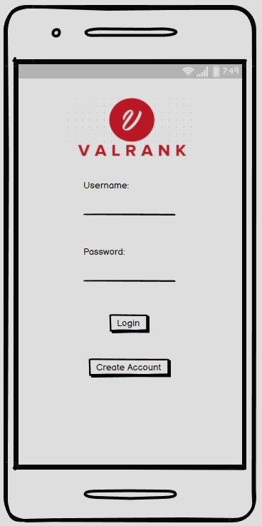
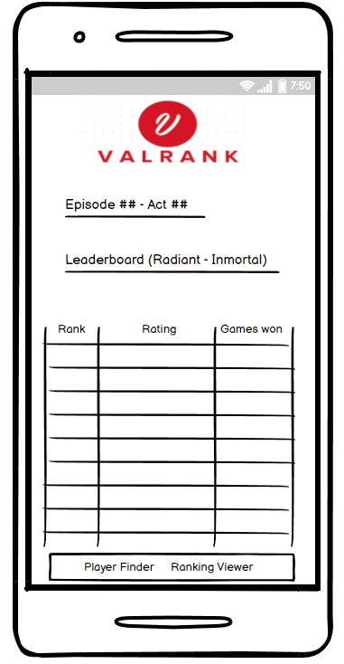
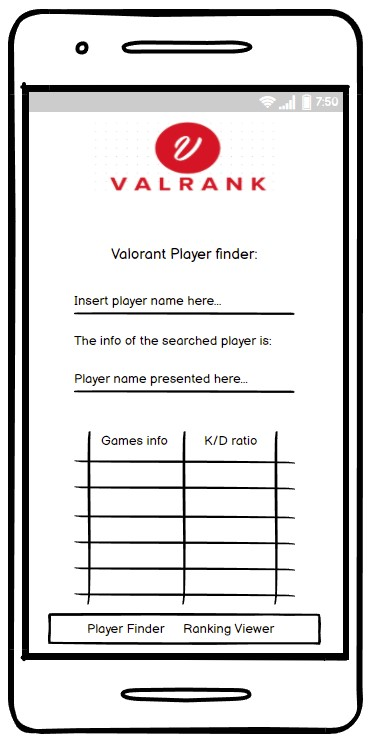
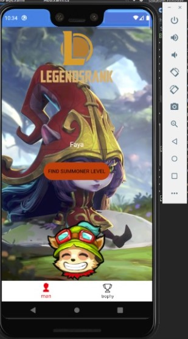

# **PROYECTO FINAL**

### Descripcion del proyecto: LegendsRank es una aplicación creada para mostrarte estadisticas de cualquier usuario que sea de  de cualquier  de fútbol en tiempo real, además de brindarte las estadísticas del desempeño de los equipos y de cada jugador de forma individual.

## Mockup:

 

### Trello board:

https://trello.com/b/3PKhTRPR/legendsrank-xamarin-app

### Screenshots of our app:

### Miembros del equipo:
| Nombres          | ID          |
| :----            |    :----:   |
| Robert Genao     | 1071499     |
| Jhonatan Sanchez | 1076689     |

Robert Genao
Jhonatan Sanchez

### Librerias utilizadas:

Prism; Prism.Ioc; Prism.Unity; Prism.Navigation; Prism.Services; Xamarin.Forms; Xamarin.Forms.Xaml;

### Presentacion:

https://docs.google.com/presentation/d/1WOTUjJLBcGkAhhNRMWlpnnXtHqEvDRbcnqZPjF53y2Y/edit?usp=sharing

